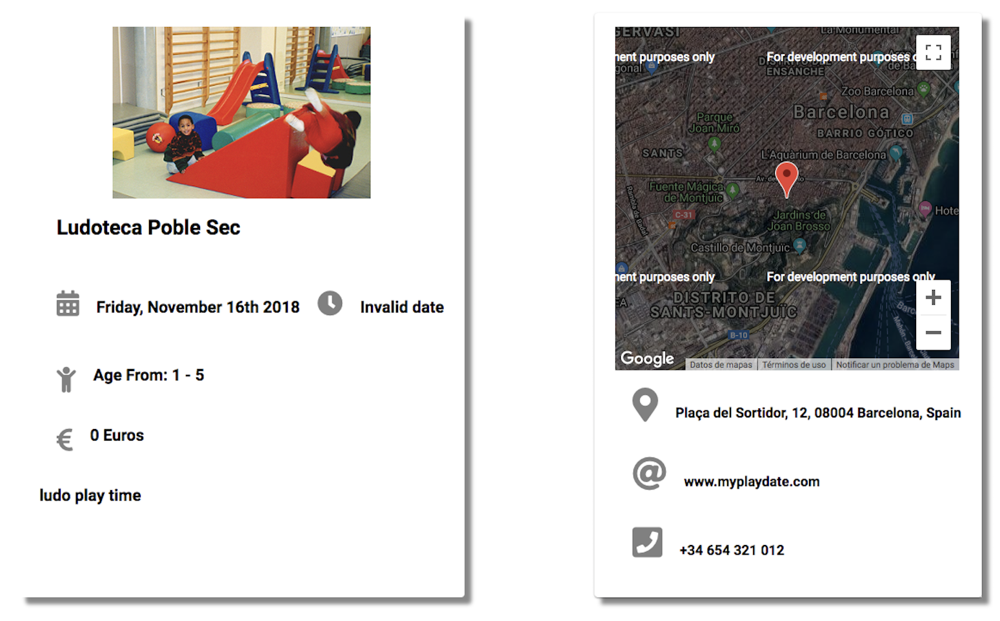

# Play Dates

<p>
Play Dates makes it easy to find activities that are going on for kids near you.  You can filter by time, locations, price or age to find the best event for your kids. Alternatively, if you are hosting an event, you can create your own play date.
</p>

## Table of contents

* [Screenshots](#screenshots)
* [Getting started](#getting-started)
* [Usage](#usage)
* [Tech Stack](#tech-stack)
* [Contributors](#contributors)


## Screenshots

<p align="center">
  
  </p>
  <p align="center">
  
  </p>


## Getting started

A few things you have to take in consideration before using Play - Dates

After cloning the repo you'll have to :

### Install global and local dependancies:

- [Node](https://nodejs.org/en/): `brew install node`
- [Npm](https://www.npmjs.com/): `npm install`
- [Homebrew](https://brew.sh/) 

### Migrate and connect Postgres database

Install PostgreSQL on your machine:

```bash
brew install postgres
```

Access PostgresSQL command line on the default database "postgres":

```bash
psql postgres
```

Your bash should now look like this:

```bash
psql (10.5)
Type "help" for help.

postgres=#
```

Now create a new database for the current user and connect it:

```bash
postgres=# CREATE DATABASE play-date-dev;
postgres=# \c play-date-dev;
```

The result will be:

```bash
You are now connected to database "play-date-dev" as user <user-name>.
play-date-dev=#
```

Now set a password for the current user:

```bash
play-date-dev=# ALTER USER <user_name> WITH PASSWORD 'new_password';
```

**Always remember the semicolon or the syntax will not work.**

Now your database setup is finished and you are ready to connect it with the server.

You can change the port or database name on postgres configuration database.

If you would like to use other SQL database you should just configure it in server/ config/config.json.

Finally, migrate the database on your local machine:

```bash
cd server
npm run recreateDb
```
### Social logins 

**Google App:** go to [Google API Console](https://console.developers.google.com/apis/credentials) create app and setup OAuth client ID following [this steps](https://developers.google.com/authorized-buyers/rtb/open-bidder/google-app-guide).

**Facebook App:** go to [Facebook for developers](https://developers.facebook.com/docs/apps/) create app and setup oAuth.

In client/src/config.js 
```javascript
export const googleToken = 'your_google_token';
export const facebookToken = 'your_facebook_token';
```

## Usage

1. Start the server:

```bash
cd server
node index.js
```

2. Start the React development environment that will build the JS bundle for your app.

```bash
cd client
npm start
```

## Tech Stack

### Back-end:

- [Express](https://expressjs.com/)
- [PostgreSQL](https://www.postgresql.org/)
- [Sequelize](http://docs.sequelizejs.com/)

### Front-end: 

- [React](https://reactjs.org/) 
- [Redux](https://redux.js.org/)

## Contributors

- Charlie Rutland - [GitHub](https://github.com/charlierutland) - [LinkedIn](https://www.linkedin.com/in/charlie-rutland/)
- Damien Derail - [GitHub](https://github.com/Damien1208) - [LinkedIn](https://www.linkedin.com/in/damien-derail-b446932a/) 
- Iñigo Solano Pàez - [GitHub](https://github.com/1334) - [LinkedIn](https://www.linkedin.com/in/inigo-solano/)
- Leandro Marques [GitHub](https://github.com/rusomarques) - [LinkedIn](https://www.linkedin.com/in/leandro-marques-pereira/) 
